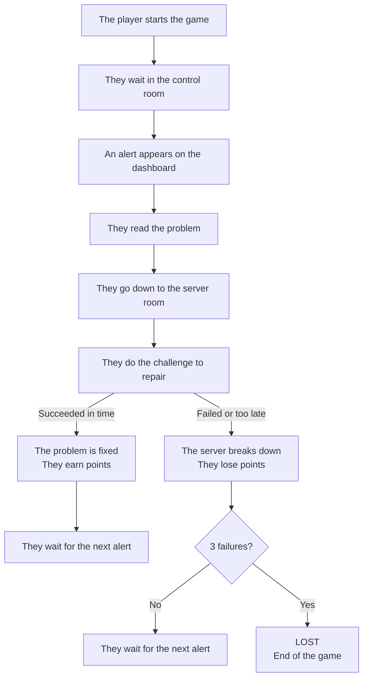
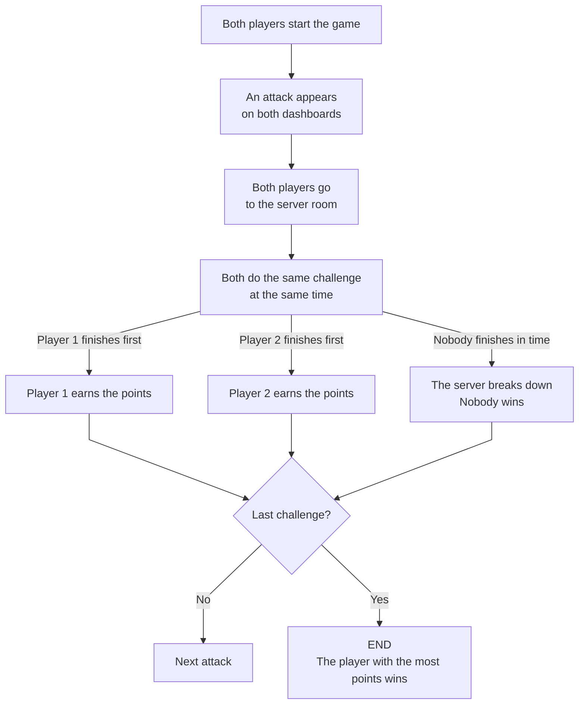

# Game diagram

Every possibility in a game: keep going, win or lose.

## 1. One player

```mermaid
%%{init: {"flowchart": {"curve": "linear"}}}%%
flowchart TD
    A["The player starts the game"] --> B["They wait in the control room"]
    B --> C["An alert appears on the dashboard"]
    C --> D["They read the problem"]
    D --> E["They go down to the server room"]
    E --> F["They do the challenge to repair"]
    F -->|"Succeeded in time"| G["The problem is fixed<br/>They earn points"]
    F -->|"Failed or too late"| H["The server breaks down<br/>They lose points"]
    G --> I["They wait for the next alert"]
    H --> J{"3 failures?"}
    J -->|"No"| K["They wait for the next alert"]
    J -->|"Yes"| L["LOST<br/>End of the game"]
```

## 2. Two players

```mermaid
%%{init: {"flowchart": {"curve": "linear"}}}%%
flowchart TD
    A["Both players start the game"] --> B["An attack appears<br/>on both dashboards"]
    B --> C["Both players go<br/>to the server room"]
    C --> D["Both do the same challenge<br/>at the same time"]
    D -->|"Player 1 finishes first"| E["Player 1 earns the points"]
    D -->|"Player 2 finishes first"| F["Player 2 earns the points"]
    D -->|"Nobody finishes in time"| G["The server breaks down<br/>Nobody wins"]
    E --> H{"Last challenge?"}
    F --> H
    G --> H
    H -->|"No"| I["Next attack"]
    H -->|"Yes"| J["END<br/>The player with the most points wins"]
```
