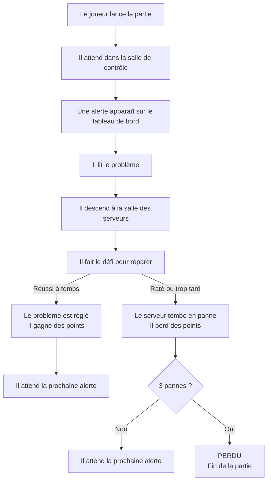
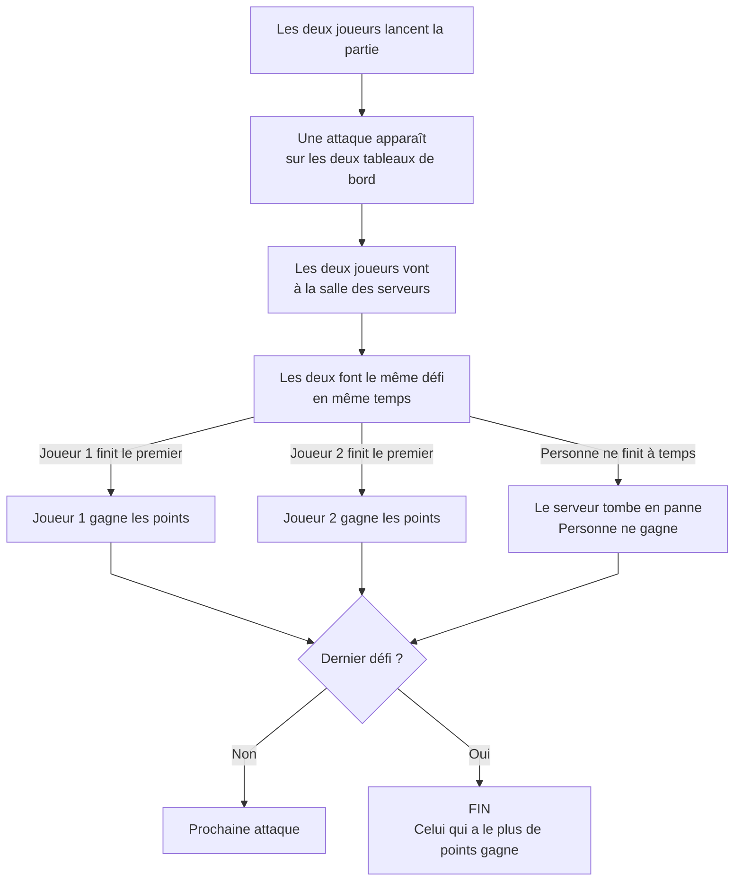

# Diagramme du jeu

Toutes les possibilités d'une partie : continuer, gagner ou perdre.

## 1. Un joueur

```mermaid
%%{init: {"flowchart": {"curve": "linear"}}}%%
flowchart TD
    A["Le joueur lance la partie"] --> B["Il attend dans la salle de contrôle"]
    B --> C["Une alerte apparaît sur le tableau de bord"]
    C --> D["Il lit le problème"]
    D --> E["Il descend à la salle des serveurs"]
    E --> F["Il fait le défi pour réparer"]
    F -->|"Réussi à temps"| G["Le problème est réglé<br/>Il gagne des points"]
    F -->|"Raté ou trop tard"| H["Le serveur tombe en panne<br/>Il perd des points"]
    G --> I["Il attend la prochaine alerte"]
    H --> J{"3 pannes ?"}
    J -->|"Non"| K["Il attend la prochaine alerte"]
    J -->|"Oui"| L["PERDU<br/>Fin de la partie"]
```

## 2. Deux joueurs

```mermaid
%%{init: {"flowchart": {"curve": "linear"}}}%%
flowchart TD
    A["Les deux joueurs lancent la partie"] --> B["Une attaque apparaît<br/>sur les deux tableaux de bord"]
    B --> C["Les deux joueurs vont<br/>à la salle des serveurs"]
    C --> D["Les deux font le même défi<br/>en même temps"]
    D -->|"Joueur 1 finit le premier"| E["Joueur 1 gagne les points"]
    D -->|"Joueur 2 finit le premier"| F["Joueur 2 gagne les points"]
    D -->|"Personne ne finit à temps"| G["Le serveur tombe en panne<br/>Personne ne gagne"]
    E --> H{"Dernier défi ?"}
    F --> H
    G --> H
    H -->|"Non"| I["Prochaine attaque"]
    H -->|"Oui"| J["FIN<br/>Celui qui a le plus de points gagne"]
```
